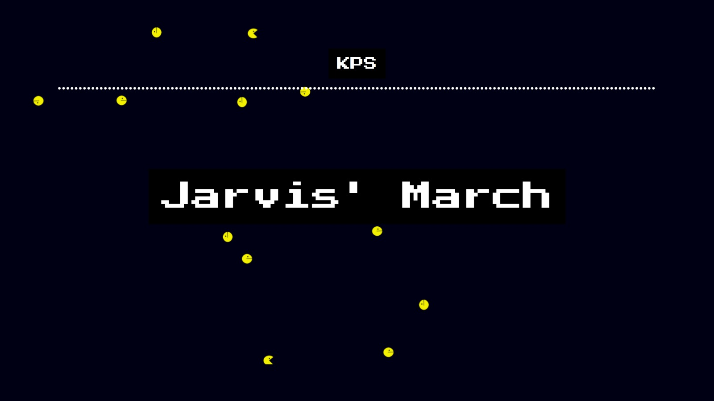

# Convex Hull Visualizer

Welcome to the Convex Hull Visualizer! This React-based web application showcases two classic convex hull algorithms: the Kirkpatrick–Seidel (KPS) algorithm and Jarvis' March, presented in the theme of the retro game Pacman.

## Contributors
| Name |
| :-------- |
| `Pratik Patil` |
| `Himanshu Patil` |
| `Nishit Poddar` |
| `Sarvesh Borole` |

## Features

- **Kirkpatrick–Seidel (KPS) Algorithm Visualization**: 
Experience the KPS algorithm in action as it efficiently computes the convex hull of a set of points. Watch as the algorithm navigates through the points, resembling the movement of Pacman gobbling up pellets.

- **Jarvis' March Visualization**: Witness the simplicity and elegance of Jarvis' March as it constructs the convex hull by repeatedly choosing the point with the smallest polar angle. The visual representation pays homage to the iconic Pacman game, adding a playful touch to computational geometry.

- **Interactive Interface**: Interact with the visualizations to gain a deeper understanding of how these algorithms work. Explore different sets of points and observe how the convex hull evolves with each iteration and enjoy the spectacle of Pacman chasing and eating ghosts in the end.

## How to play

- ### Home Page
    - To experience the `Kirkpatrick–Seidel (KPS) algorithm` in action, hover over `KPS` and click on it.

    - To experience the `Jarvis' March (Gift Wrapping) algorithm` in action, hover over `Jarvis' March` and click on it.

- ### Canvas
    - Input points onto the rectangular canvas depicted below to calculate the convex hull either by clicking directly on the canvas or by using other buttons and utilities discussed later.

- ### Buttons
    1. **Add Point:** Enter points in format `x,y` in the text box and press `ADD` button to add the point to canvas.

        
        

    2. **Clear:** To reset the canvas, just click on the `Clear` button.

        

    3. **Finish:** Once you've added the points, simply press the `Finish` button to compute of the convex hull.

        

    4. **Next:** After calculating the convex hull, proceed by clicking the `Next` button below to begin the step-by-step visualization of KPS. Additionally, please note that descriptions of the current steps will appear in the textbox beside. Repeat this process as needed.

        

    5. **Previous:** To navigate back to the previous step in the visualization, simply click the `Previous` button.

        

    6. **Skip:** To automate the process of visualization, press the `Skip` button.

        
    

- ### Common Utilities
    1. To add desired number of random points to the canvas, enter the number in the textbox shown below and press `q`.

        

    2. Press `Right Arrow` to move to next step (emulates the `Next` button).

    3. Press `Left Arrow` to move to previous step (emulates the `Previous` button).

    4. `f`: By utilizing this key we can input points to the canvas using File I/O (File Type: .txt) (Text Format: x,y & each point on new line).

- ###  KPS Utilities
    1. `l`: Pressing this key skips the visualization of lower hull and displays it.

    2. `u`: Pressing this key skips the visualization of upper hull and displays it.

    3. `b`: Pressing this key skips the visualization to the nearest lower/upper bridge and displays it.

    4. `h`: Pressing this key skips the entire visualization and displays the final hull.

- ###  Jarvis' March Utilities
    1. `s`: Pressing this key skips the visualization of one iteration of Jarvis' March and displays the new hull edge.

    2. `h`: Pressing this key skips the entire visualization and displays the final hull.

        
## Where to play: https://sarvesh788.github.io/Convex-Hull

## How to install

This project was bootstrapped with [Create React App](https://github.com/facebook/create-react-app).

### Available Scripts

In the project directory, you can run:

- `npm start`

    Runs the app in the development mode.\
Open [http://localhost:3000](http://localhost:3000) to view it in your browser.\
The page will reload when you make changes.\

    You may also see any lint errors in the console.

- `npm test`

    Launches the test runner in the interactive watch mode.\
See the section about [running tests](https://facebook.github.io/create-react-app/docs/running-tests) for more information.

- `npm run build`

    Builds the app for production to the `build` folder.\
It correctly bundles React in production mode and optimizes the build for the best performance.

    The build is minified and the filenames include the hashes.\
Your app is ready to be deployed!

    See the section about [deployment](https://facebook.github.io/create-react-app/docs/deployment) for more information.

- `npm run eject`

    **Note: this is a one-way operation. Once you `eject`, you can't go back!**

    If you aren't satisfied with the build tool and configuration choices, you can `eject` at any time. This command will remove the single build dependency from your project.

    Instead, it will copy all the configuration files and the transitive dependencies (webpack, Babel, ESLint, etc) right into your project so you have full control over them. All of the commands except `eject` will still work, but they will point to the copied scripts so you can tweak them. At this point you're on your own.

    You don't have to ever use `eject`. The curated feature set is suitable for small and middle deployments, and you shouldn't feel obligated to use this feature. However we understand that this tool wouldn't be useful if you couldn't customize it when you are ready for it.

## Learn More

You can learn more in the [Create React App documentation](https://facebook.github.io/create-react-app/docs/getting-started).

To learn React, check out the [React documentation](https://reactjs.org/).

### Code Splitting

This section has moved here: [https://facebook.github.io/create-react-app/docs/code-splitting](https://facebook.github.io/create-react-app/docs/code-splitting)

### Analyzing the Bundle Size

This section has moved here: [https://facebook.github.io/create-react-app/docs/analyzing-the-bundle-size](https://facebook.github.io/create-react-app/docs/analyzing-the-bundle-size)

### Making a Progressive Web App

This section has moved here: [https://facebook.github.io/create-react-app/docs/making-a-progressive-web-app](https://facebook.github.io/create-react-app/docs/making-a-progressive-web-app)

### Advanced Configuration

This section has moved here: [https://facebook.github.io/create-react-app/docs/advanced-configuration](https://facebook.github.io/create-react-app/docs/advanced-configuration)

### Deployment

This section has moved here: [https://facebook.github.io/create-react-app/docs/deployment](https://facebook.github.io/create-react-app/docs/deployment)

### `npm run build` fails to minify

This section has moved here: [https://facebook.github.io/create-react-app/docs/troubleshooting#npm-run-build-fails-to-minify](https://facebook.github.io/create-react-app/docs/troubleshooting#npm-run-build-fails-to-minify)
